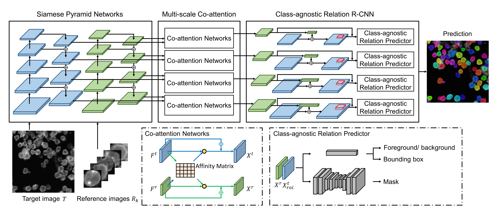

# Class-agnostic Few-shot Instance Segmentation of Digital Pathological Images



This project is a pure pytorch implementation of *Class-agnostic Few-shot Instance Segmentation of Digital Pathological Images*. A majority of the code is modified from [roytseng-tw/Detectron.pytorch](https://github.com/roytseng-tw/Detectron.pytorch).

## Getting Started
Clone the repo:

```bash
git clone https://github.com/Min-Sheng/CA_FSIS_Cell.git
```

## Requirements

Tested under python3.

- python packages
  - pytorch>=0.3.1
  - torchvision>=0.2.0
  - cython
  - matplotlib
  - numpy
  - scipy
  - opencv
  - pyyaml
  - packaging
  - [pycocotools](https://github.com/cocodataset/cocoapi)  — for COCO dataset, also available from pip.
  - tensorboardX  — for logging the losses in Tensorboard.
- An NVIDAI GPU and CUDA 8.0 or higher. Some operations only have gpu implementation.

## Compilation

Compile the cuda dependencies using following simple commands:

```bash
cd lib  # please change to this directory
sh make.sh
```

It will compile all the modules you need, including NMS, ROI_Pooing, ROI_Crop and ROI_Align. (Actually gpu nms is never used ...).

## Data Preparation

Create a data folder under the repo,

```bash
cd {repo_root}
mkdir data
```

- **FIS-Cell**:
  Download the FIS-Cell(Few-shot Instance Segmentation for Cell images) dataset from [Google Drive](https://drive.google.com/drive/folders/17UnKm7-Fa4vjf3o58-alj1WhHWfrKGtg?usp=sharing).

  Feel free to put the dataset at any place you want, and then soft link the dataset under the `data/` folder:

   ```bash
   ln -s path/to/FIS-Cell data/fis_cell
   ```

  Recommend to put the images on a SSD for possible better training performance.

## Pretrained Model

We use ResNet50 as the pretrained model in our experiments. This pretrained model is from [timy90022/One-Shot-Object-Detection](https://github.com/timy90022/One-Shot-Object-Detection) and available at:

* ResNet50: [Google Drive](https://drive.google.com/file/d/1SL9DDezW-neieqxWyNlheNefwgLanEoV/view?usp=sharing)

Download and unzip them into the `{repo_root}/data/`.

## Training

Use the environment variable `CUDA_VISIBLE_DEVICES` to control which GPUs to use.

In FIS-Cell dataset, we split it into 5 class splits. It will train and test different class. Just to adjust `--g (1~5)`.

If you want to train parts of the dataset, try to modify `--seen`:

- 1: only see training class (for training).
- 2: only see testing class (for testing).
- 3: see both training class and testing class.

### Adapative config adjustment

### Setting

- batch_size:            `NUM_GPUS` x `TRAIN.IMS_PER_BATCH`  
- effective_batch_size:  batch_size x `iter_size`  
- change of somethining: `new value of something / old value of something`

Following config options will be adjusted **automatically** according to actual training setups: 
1. number of GPUs `NUM_GPUS`
2. batch size per GPU `TRAIN.IMS_PER_BATCH`
3. update period `iter_size`

- `SOLVER.BASE_LR`: adjust directly propotional to the change of batch_size.
- `SOLVER.STEPS`, `SOLVER.MAX_ITER`: adjust inversely propotional to the change of effective_batch_size.

### Train from scratch

To train a model with ResNet50 on FIS-Cell, simply run:

```bash
python tools/train_net_step.py --dataset fis_cell --use_tfboard --bs {batch_size} --nw {num_workers} --g {split_id} --seen {seen_id} --k {num_shots}
```

Use `--bs` to overwrite the default batch size to a proper value that fits into your GPUs. Simliar for `--nw`, number of data loader threads defaults to 4 in config.py.

Specify `—-use_tfboard` to log the losses on Tensorboard.

### Finetune from a pretrained checkpoint

```bash
python tools/train_net_step.py ... --load_ckpt {path/to/the/checkpoint}
```

### Resume training with the same dataset and batch size

```bash
python tools/train_net_step.py ... --load_ckpt {path/to/the/checkpoint} --resume
```
When resume the training, **step count** and **optimizer state** will also be restored from the checkpoint. For SGD optimizer, optimizer state contains the momentum for each trainable parameter.

## Inference

### Evaluate the training results
To test the model on FIS-Cell, simply run:

```bash
python tools/test_net_few_shot.py --dataset fis_cell --load_ckpt {path/to/your/checkpoint} --g {split_id} --seen {seen_id} --k {num_shots} --a {avg_iters} --vis
```
Specify a different output directry, use `--output_dir {...}`. Defaults to `{the/parent/dir/of/checkpoint}/test`

## Configuration Options

Architecture specific configuration files are put under [configs](configs/). The general configuration file is [lib/core/config.py](lib/core/config.py).

## Acknowledgments
Code is based on [roytseng-tw/Detectron.pytorch](https://github.com/roytseng-tw/Detectron.pytorch) and [timy90022/One-Shot-Object-Detection](https://github.com/timy90022/One-Shot-Object-Detection) and [oeway/pytorch-deform-conv](https://github.com/oeway/pytorch-deform-conv).
